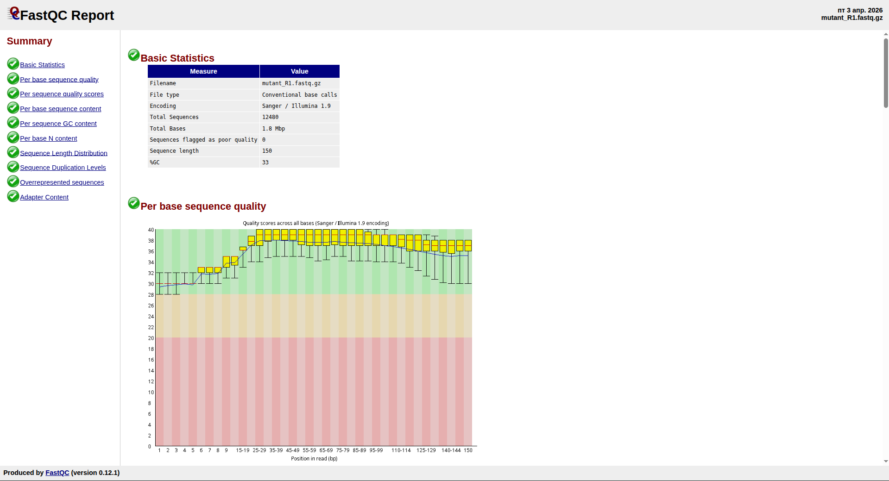
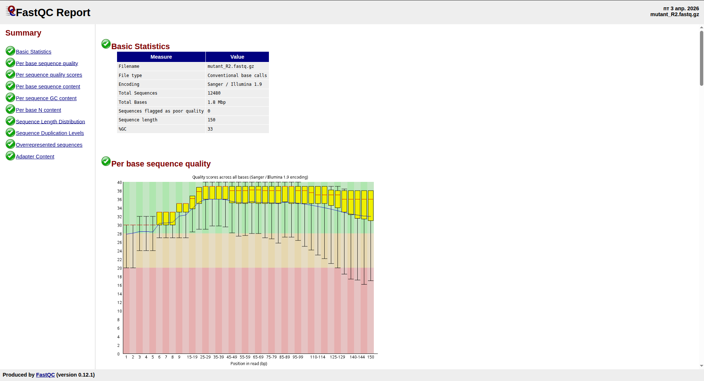
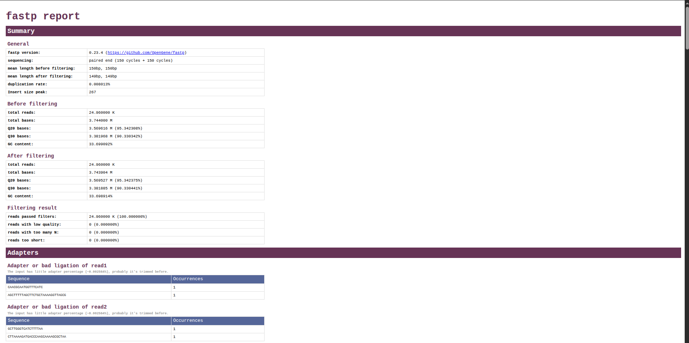
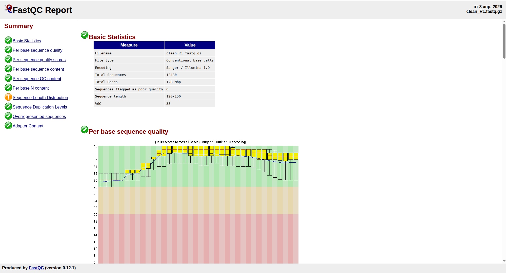
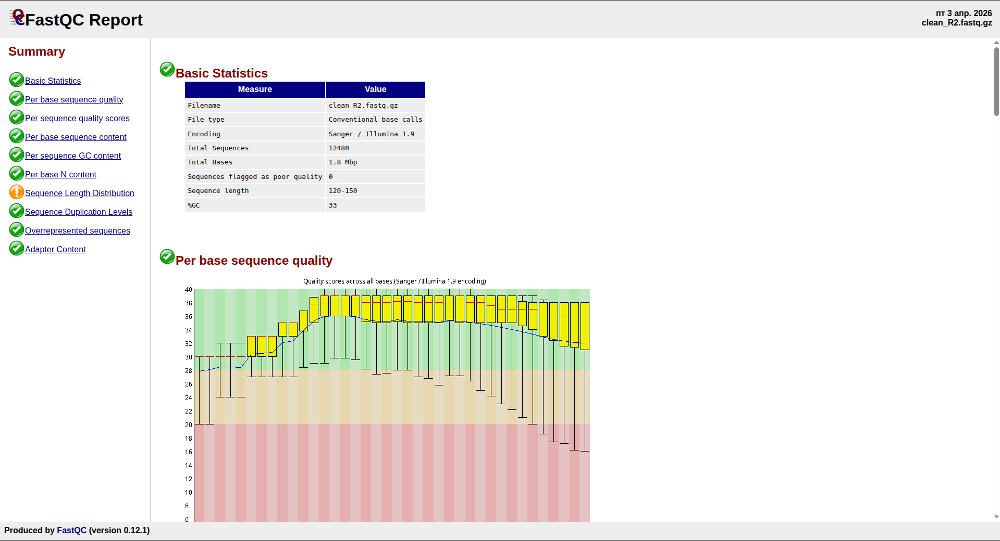
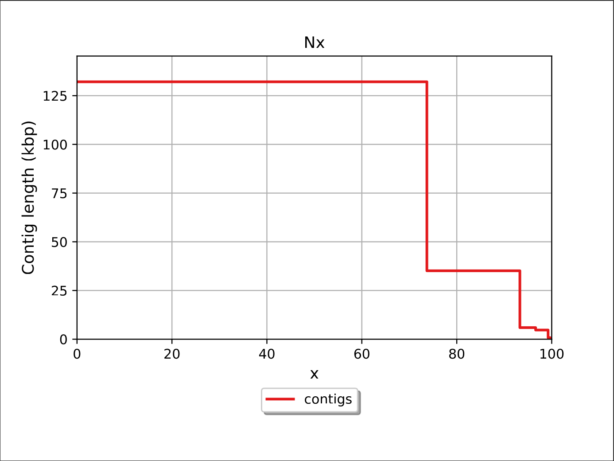
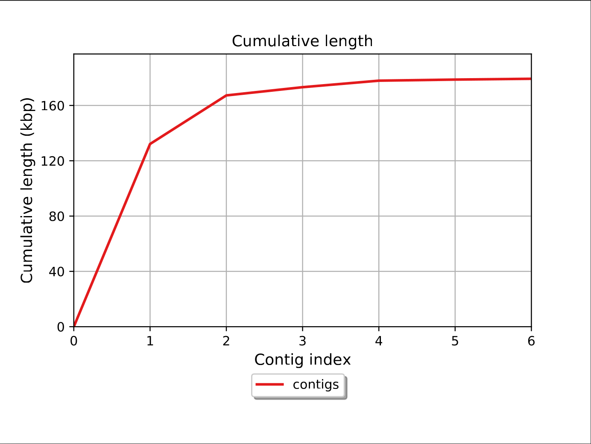
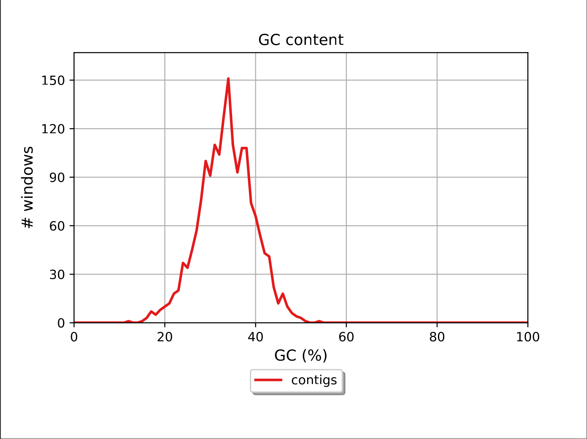
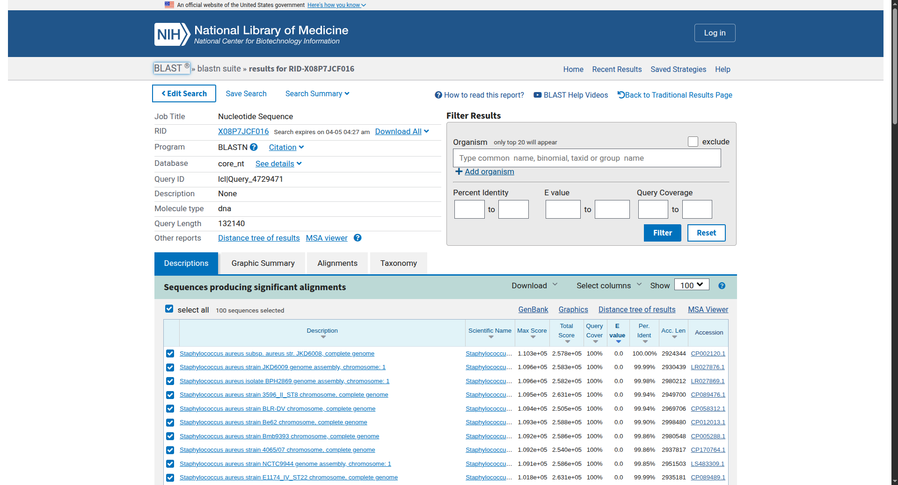

# Отчёт по выполнению

Перед выполнением работы устанавливаем необходимые инструменты:

```bash
conda create -n assembly_env -y
conda activate assembly_env
conda install -c bioconda fastqc fastp spades quast -y
```

## Шаг 1. Проверка качества данных

Скачиваем данные по [ссылке](https://zenodo.org/records/582600), нам нужны только `mutant_R1.fastq` и `mutant_R2.fastq`.  
Архивируем их с помощью `gzip` (`.gz` файлы нам позже понадобятся):

```bash
gzip ./data/mutant_R1.fastq && gzip ./data/mutant_R2.fastq
```

Далее запускаем анализ качества данных с помощью **FastQC** (`-o` - каталог для вывода результатов):

```bash
fastqc ./data/mutant_R1.fastq.gz ./data/mutant_R2.fastq.gz -o ./data/fastqc
```

Результаты анализа находятся в HTML файлах `mutant_R1_fastqc.html` и `mutant_R2_fastqc.html`.





Как мы видим, данные в целом хорошие (per sequence quality score`ы в целом больше 30, распределение GC (пар вида цитозин-гуанин) близко к теоретическому, адаптеры практически отсутствуют), однако во втором файле на boxplot'ax заметно некоторое отклонение от зелёной зоны на первых и последних позициях.

## Шаг 2. Очистка данных

Несмотря на то, что данные практически не требуют очистки (судя по анализу), сделаем её на всякий случай с помощью команды `fastp`:

```bash
fastp -i ./data/mutant_R1.fastq.gz -I ./data/mutant_R2.fastq.gz -o ./data/clean_R1.fastq.gz -O ./data/clean_R2.fastq.gz -h ./data/fastp/fastp.html -j ./data/fastp/fastp.json -q 20 -u 30 -n 5 -l 50
```

Флаги команды:
- `-i` и `-I` - первый входной и второй входной файлы соответственно
- `-o` и `-O` - первый очищенный и второй очищенный файлы соответственно
- `-h` и `-j` - отчёты в форматах HTML и JSON соответственно
- `-q` - quality value (всё, что выше данного значения, рассматривается как качественные данные)
- `-u` - сколько процентов «грязных» данных максимум должно получиться в итоге
- `-n` - если текущий номер в риде (количество неопределённых нуклеотидов) больше данного значения, то данный рид пропускается
- `-l` - минимальная допустимая длина рида

Вывод команды:

```
Read1 before filtering:
total reads: 12480
total bases: 1872000
Q20 bases: 1831333(97.8276%)
Q30 bases: 1769308(94.5143%)

Read2 before filtering:
total reads: 12480
total bases: 1872000
Q20 bases: 1738283(92.857%)
Q30 bases: 1612660(86.1464%)

Read1 after filtering:
total reads: 12480
total bases: 1871952
Q20 bases: 1831286(97.8276%)
Q30 bases: 1769263(94.5143%)

Read2 after filtering:
total reads: 12480
total bases: 1871952
Q20 bases: 1738241(92.8571%)
Q30 bases: 1612622(86.1465%)

Filtering result:
reads passed filter: 24960
reads failed due to low quality: 0
reads failed due to too many N: 0
reads failed due to too short: 0
reads with adapter trimmed: 4
bases trimmed due to adapters: 96

Duplication rate: 0.00801282%

Insert size peak (evaluated by paired-end reads): 267

JSON report: ./results/fastp/fastp.json
HTML report: ./results/fastp/fastp.html

fastp -i ./data/mutant_R1.fastq.gz -I ./data/mutant_R2.fastq.gz -o ./results/clean_R1.fastq.gz -O ./results/clean_R2.fastq.gz -h ./results/fastp/fastp.html -j ./results/fastp/fastp.json -q 20 -u 30 -n 5 -l 50 
fastp v0.23.4, time used: 1 seconds
```



Как мы видим в отчёте, инструмент обнаружил по два адаптера в каждом из файлов, на графиках данные практически никак не изменились, процент дублирующихся данных составляет 0.00801282% (что в целом довольно мало).

Проверяем на всякий случай получившиеся данные с помощью **FastQC**:

```bash
fastqc ./data/clean_R1.fastq.gz ./data/clean_R2.fastq.gz -o ./data/fastqc_clean
```




На распределении длин последовательностей стал заметен большой скачок в конце. Хотя это может оказаться «ложным» сигналом, в итоге берём исходные данные для дальнейшей сборки организма.

## Шаг 3. Сборка генома

Сделаем сборку генома организма из исходных данных с помощью команды `spades.py` (команда не работает с файлами, путь у которых содержит кириллицу, поэтому перемещаем их перед её исполнением):

```bash
spades.py -1 mutant_R1.fastq.gz -2 mutant_R2.fastq.gz -o spades_output
```

Логи сборки находятся в файле `spades.log`, ниже приведены общие результаты сборки:

```
===== Assembling finished. Used k-mer sizes: 21, 33, 55, 77 

 * Corrected reads are in /home/user/spades_output/corrected/
 * Assembled contigs are in /home/user/spades_output/contigs.fasta
 * Assembled scaffolds are in /home/user/spades_output/scaffolds.fasta
 * Paths in the assembly graph corresponding to the contigs are in /home/user/spades_output/contigs.paths
 * Paths in the assembly graph corresponding to the scaffolds are in /home/user/spades_output/scaffolds.paths
 * Assembly graph is in /home/user/spades_output/assembly_graph.fastg
 * Assembly graph in GFA format is in /home/user/spades_output/assembly_graph_with_scaffolds.gfa

======= SPAdes pipeline finished.
```

## Шаг 4. Оценка сборки

Оцениваем качество сборки генома организма с помощью команды `quast.py` (как и команда `spades.py`, команда не работает с файлами, путь у которых содержит кириллицу, поэтому перемещаем их перед её исполнением):

```bash
quast.py spades_output/contigs.fasta -o quast_output
```

Команда вывела результат в отчёт в форматах HTML, PDF, TSV, TXT и TeX, ниже приведены общие результаты и графики:

```
All statistics are based on contigs of size >= 500 bp, unless otherwise noted (e.g., "# contigs (>= 0 bp)" and "Total length (>= 0 bp)" include all contigs).

Assembly                    contigs
# contigs (>= 0 bp)         7      
# contigs (>= 1000 bp)      4      
# contigs (>= 5000 bp)      3      
# contigs (>= 10000 bp)     2      
# contigs (>= 25000 bp)     2      
# contigs (>= 50000 bp)     1      
Total length (>= 0 bp)      179607 
Total length (>= 1000 bp)   177919 
Total length (>= 5000 bp)   173211 
Total length (>= 10000 bp)  167264 
Total length (>= 25000 bp)  167264 
Total length (>= 50000 bp)  132140 
# contigs                   6      
Largest contig              132140 
Total length                179288 
GC (%)                      33.59  
N50                         132140 
N75                         35124  
L50                         1      
L75                         2      
# N's per 100 kbp           0.00   
```





Судя по значению N50 = 132140, что совпадает с длиной самого длинного контига и составляет более 73% от длины всего генома, по отсутствию mismatch`ей, по малому количеству контигов, а также по тому, что график GC Content практически совпадает по распределению с соотвествующим графиком для исходных данных, можно сказать, что сборка вышла довольно качественной.

## Шаг 5. Определение организма

Копируем первый контиг в [BLAST](https://blast.ncbi.nlm.nih.gov/Blast.cgi) (выбираем **blastn**, так как у нас ДНК, а не белок):



Результат показывает, что у нас организм вида *Staphylococcus aureus* (Золотистый стафилококк), а если быть точнее (по первому результату, совпадение с которым составляет 100%), у нас штамм *Staphylococcus aureus subsp. aureus strain*, который, судя по некоторым данным, является устойчивым к антибиотикам.

## Шаг 6. Поиск резистентности

[Статья о метициллинрезистентном золотистом стафилококке в Википедии](https://en.wikipedia.org/wiki/Methicillin-resistant_Staphylococcus_aureus)  
[Статья о мобильном генетическом элементе *SCCmec* в Википедии](https://en.wikipedia.org/wiki/SCCmec)

Гены, которые могут вызвать устойчивость к антибиотикам - это прежде всего *mecA*, но могут также встретиться регуляторные гены *mecI* и *mecR1* или ген *psm-mec* (и некоторые другие).

Воспользуемся сайтом [ResFinder](https://genepi.food.dtu.dk/resfinder) (сюда загружаем файл `contigs.fasta`):

Ниже приведены общие результаты (файл `ResFinder_results_table.txt`):

```
Aminoglycoside
Resistance gene	Identity	Alignment Length/Gene Length	Coverage	Position in reference	Contig	Position in contig	Phenotype	Accession no.
aadD	100.00	762/762	100.0	1..762	NODE_4_length_4708_cov_19.958324	218..979	Amikacin, Tobramycin	M19465

Beta-lactam
Resistance gene	Identity	Alignment Length/Gene Length	Coverage	Position in reference	Contig	Position in contig	Phenotype	Accession no.
mecA	100.00	2007/2007	100.0	1..2007	NODE_1_length_132140_cov_9.694812	127897..129903	Amoxicillin, Amoxicillin+Clavulanic acid, Ampicillin, Ampicillin+Clavulanic acid, Cefepime, Cefixime, Cefotaxime, Cefoxitin, Ceftazidime, Ertapenem, Imipenem, Meropenem, Piperacillin, Piperacillin+Tazobactam	BX571856

Colistin
No hit found

Fosfomycin
No hit found

Fusidic Acid
No hit found

MLS - Macrolide, Lincosamide and Streptogramin B
No hit found

Misc
No hit found

Nitroimidazole
No hit found

Oxazolidinone
No hit found

Phenicol
No hit found

Fluoroquinolone
No hit found

Rifampicin
No hit found

Sulphonamide
No hit found

Tetracycline
No hit found

Trimethoprim
No hit found

Glycopeptide
Resistance gene	Identity	Alignment Length/Gene Length	Coverage	Position in reference	Contig	Position in contig	Phenotype	Accession no.
bleO	100.00	399/399	100.0	1..399	NODE_4_length_4708_cov_19.958324	1202..1600	Bleomycin	AF051917

Pseudomonic Acid
No hit found
```

Как мы видим, в геноме действительно есть ген *mecA*, отвечающий за устойчивость бактерии к β-лактамным антибиотикам, также были обнаружены гены *aadD* и *bleO*, отвечающие за устойчивость к некоторым аминогликозидам и некоторым гликопептидам соотвественно.

## Ответы на вопросы

1. Какой организм вы обнаружили?  
В результате анализа был обнаружен штамм *Staphylococcus aureus subsp. aureus strain*, являющийся устойчивым к β-лактамным и некоторым другим антибиотикам.

2. Насколько хороша сборка?  
Сборка является достаточно качественной, судя по значению N50 = 132140, что совпадает с длиной самого длинного контига и составляет более 73% от длины всего генома, по отсутствию mismatch`ей, по малому количеству контигов, а также по тому, что график GC Content практически совпадает по распределению с соотвествующим графиком для исходных данных.

3. Есть ли признаки резистентности?  
В геноме были обнаружены признаки резистентности к β-лактамным антибиотикам (ген *mecA*), а также к некоторым аминогликозидам (ген *aadD*) и некоторым гликопептидам (ген *bleO*).

4. Почему лечение не сработало?  
Лечение не сработало, так как у бактерии есть ген *mecA*, отвечающий за устойчивость к β-лактамным антибиотикам, которые были назначены пациенту.

5. Какой диагноз можно предположить и как следует изменить терапию?  
По результатам анализа можно предположить инфекцию, вызванную MRSA (метицилин-резистентным золотистым стафилококком), для борьбы с ней следует перейти к другим антибиотикам (например, тетрациклину).  
**NB**: ставить окончательный диагноз и назначать лечение мы не можем, этим должен заниматься исключительно врач (человек, обладающим высшим медицинским образованием и необходимой специализацией).
